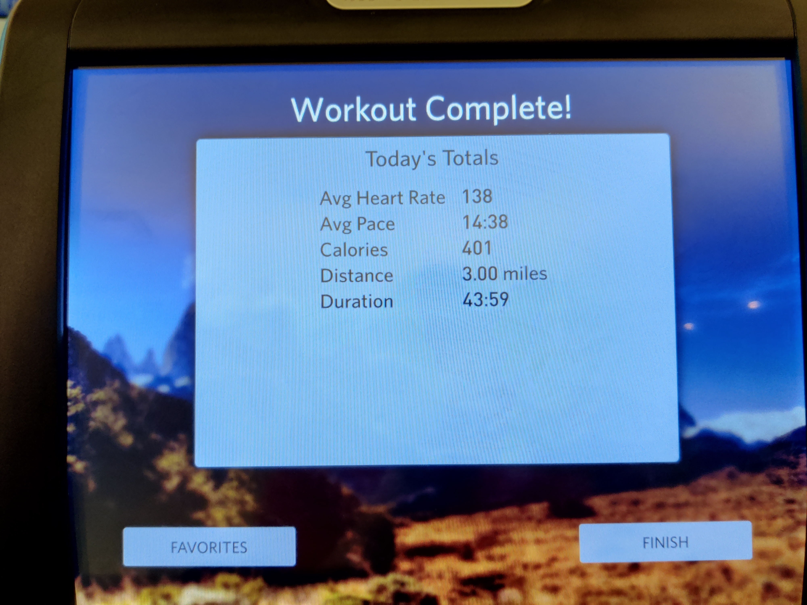
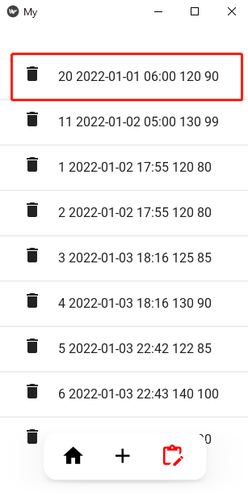

# Blood Pressure Recorder Mobile App

**Contents:**
- [Blood Pressure Recorder Mobile App](#blood-pressure-recorder-mobile-app)
  - [1. Introduction](#1-introduction)
  - [2. Home screen](#2-home-screen)
  - [3. Records list screen](#3-records-list-screen)
  - [4. Add records screen](#4-add-records-screen)
    - [4.1 Base interface](#41-base-interface)
    - [4.2 Adding records by hand](#42-adding-records-by-hand)
    - [4.3 Adding by file chooser](#43-adding-by-file-chooser)
    - [4.4 Adding by camera](#44-adding-by-camera)
  - [5. The back-end method](#5-the-back-end-method)
    - [5.1 `recog.py`: recognize value and extract time](#51-recogpy-recognize-value-and-extract-time)
    - [5.2 `sql_op.py`: database operations](#52-sql_oppy-database-operations)
  - [6. Improvement ideas](#6-improvement-ideas)

## 1. Introduction
In this repo, I developed a mobile APP to recognize picture of blood pressure monitor and store the data to `sqlite3` database. The use can view, add, edit the records. 

In my experience, taking a picture is the easiest way to record important information, such as recording blood pressure, recording logs on the running machine.

<p align="center">
  
</p>
<p align="center">
  
</p>

**About the files:**
```
```
The fron-end is designed with `kivy, kiviMD, Plyer`, back-end is implemented with python.
There are three screens:
- Home screen: show line map the records
- Adding screen, user can add records by filling out form, or uploading file, or taking a picture
- Records list screen, list all records, user can deleting selected record

## 2. Home screen
In home screen, all records are shown in scatter plot

<p align="center">
  
</p>

When new record is inserted or deleted, the figure will be updated.

## 3. Records list screen

The third creen is Viewing and editting screen, it lists all records ordered by date and time. The user can delete record by clicking deletion button.

In the below picture, the record with id 15 is deleted.
<p align="center">
  
  
</p>

**left**: before deletion     **right**: after deletion

## 4. Add records screen

### 4.1 Base interface

Below is the base interface of the middle screen.
- left one is the base interface
- right one the the camera screen when clicking camera icon
<p align="center">
  
  
</p>

Explaination of the icons:
- `black picture`: showing the photo chosen or taken by user
- `upload icon`: choosing photo from local folder
- `camera icon`: when clicking, it will switch to camera screen, by clicking the `left arrow icon`, it will switch back to the previous screen
- `High, Low, Date, Time`: text fields
- `calendar icon`: Choosing date from pop up window
- `time icon`: choosing timme from pop up window
- `cancel icon`: cancel this try, and clear all text fields
- `add icon`: adding records to database, and clear all text fields

Below is the date picker window(left) and time picker window(right).

<p align="center">
  
  
</p>

### 4.2 Adding records by hand

The user can add record by filling out the text files. 

In the following pictures:
- left one shows the filled text fields
- middle one shows the result after clicking add icon
- right one shows the added result in list
  
<p align="center">
  
  
  
</p>

### 4.3 Adding by file chooser

The user can add record by choosing photo from local folder. 
By clicking the `upload` icon, a folder explorer window will pop up, user can choose photo. Below are some results:

<p align="center">
  
  
</p>

Below pictures show the second added results in scatter plot and list.
<p align="center">
  
  
</p>

The App recognizes the pressure value correctly, it also extracts the date and time information from the file with the help of library `exifread`.

### 4.4 Adding by camera

The user can add record by taking photo with camera. 
By clicking the `camera` icon, it will switch to camera screen, by clicking the `left arrow icon`, it will switch back to the previous screen. 

Below are the results:
- Left one is the the camera screen 
- Right one is the adding record screen
  
**Note:** By using `iVCam`, I can use my cellphone's camera when coding on PC. 

<p align="center">
  
  
</p>

We can see that the App recognizes the pressure value correctly, and sets current time as it's date and time.

## 5. The back-end method

The back-end code is in files:
- `recog.py`
- `sql_op.py`

### 5.1 `recog.py`: recognize value and extract time

### 5.2 `sql_op.py`: database operations

## 6. Improvement ideas

- UI
- 